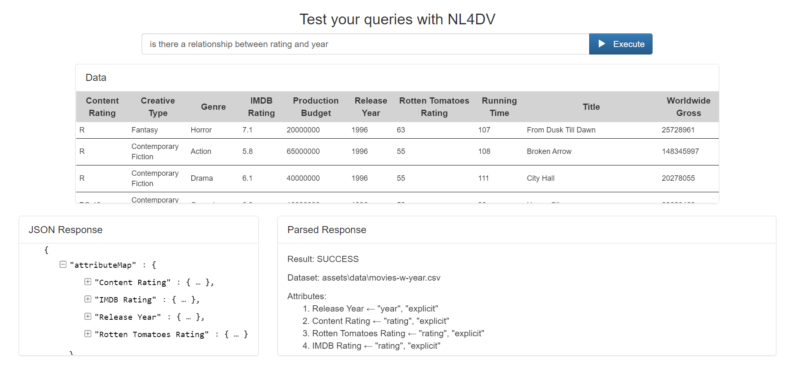

# NL4DV-Inspector

A basic inspection tool for NL4DV queries and responses.

## Installation

1. Clone this repo to your development environment
2. Follow the steps at <https://nl4dv.github.io/nl4dv/documentation.html>
3. Be sure to put the NLP jars in _assets/jars_

## Acknowledgment

Credits to the NL4DV project: https://github.com/nl4dv/nl4dv
